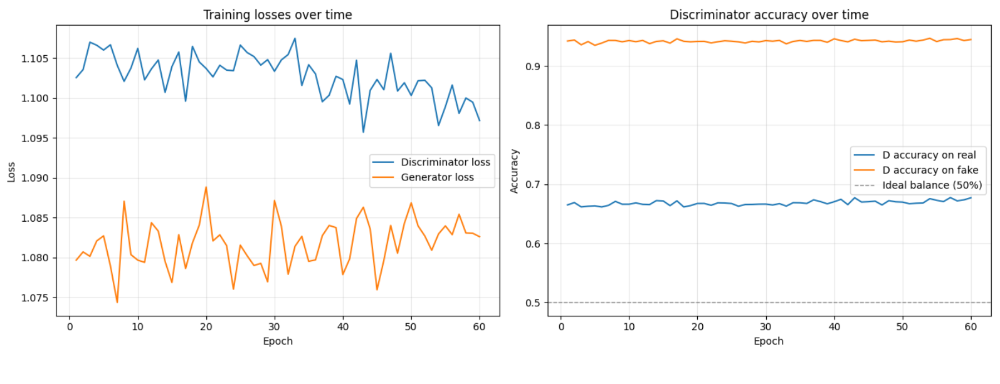
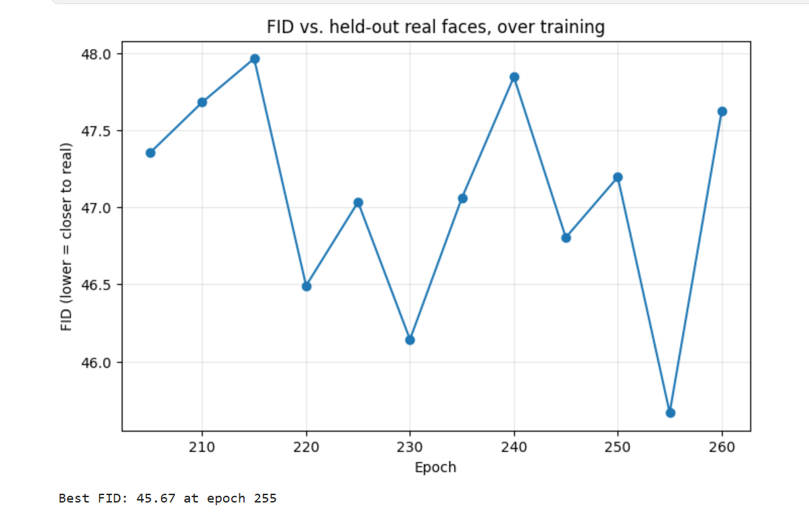
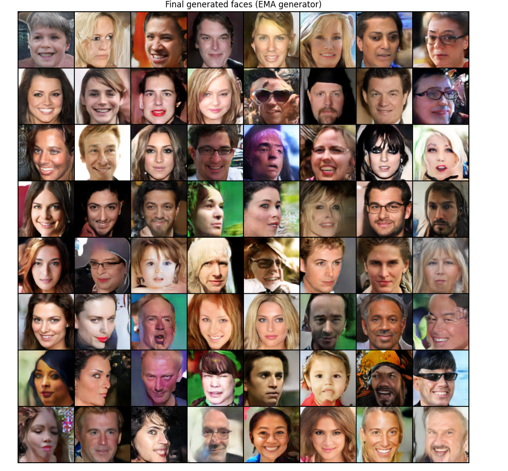
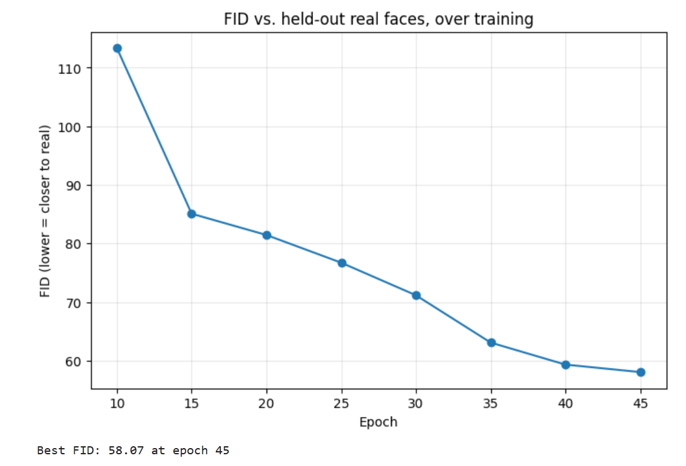
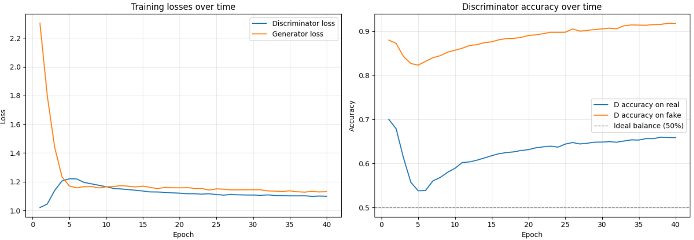
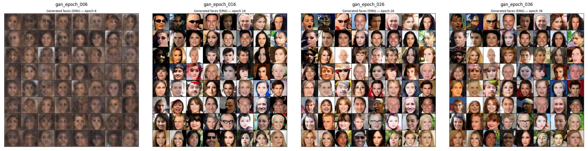

# 🎭 Realistic Human Face Generation using GAN


A Generative Adversarial Network trained to synthesize realistic human face images, built with PyTorch and trained on Kaggle. This repo documents **two architecture approaches**, trained and compared honestly - including what worked, what didn't, and what's still unfinished.

> 🚀 **Live Kaggle Notebook & App:** [gan-human-face-generation-app](https://www.kaggle.com/code/abdelhameednasr/gan-human-face-generation-app)  
> 📦 **Trained Checkpoints (`.pth`):** [face-gan-checkpoints](https://www.kaggle.com/models/abdelhameednasr/face-gan-checkpoints)

---

## Table of Contents

- [Objective](#objective)
- [Results at a Glance](#results-at-a-glance)
- [Approach 1 - DCGAN Baseline](#approach-1--dcgan-baseline)
- [Approach 2 - Self-Attention Upgrade](#approach-2--self-attention-upgrade)
- [Approach Comparison](#approach-comparison)
- [Honest Limitations](#honest-limitations)
- [Repository Structure](#repository-structure)
- [How to Run](#how-to-run)
- [The Companion App](#the-companion-app)
- [Future Work](#future-work)
- [Datasets & Acknowledgments](#datasets--acknowledgments)
- [License](#license)

---

## Objective

The goal of this project was to build and train a Generative Adversarial Network (GAN) capable of generating realistic synthetic human face images from random noise, satisfying the following:

- Understand how GANs generate new realistic images
- Build a **Generator** model to create synthetic faces
- Build a **Discriminator** model to classify real vs. fake images
- Load and preprocess a real human face dataset (crop, resize, normalize)
- Train both models adversarially, monitoring losses and saving samples over time
- Compare results over time and present final generated faces

Two distinct architectures were trained toward this goal - see below.

---

## Results at a Glance

| | Approach 1 (DCGAN Baseline) | Approach 2 (Self-Attention Upgrade) |
|---|---|---|
| **Architecture** | Plain DCGAN, BatchNorm, `feat=64` | DCGAN + self-attention + minibatch-stddev, `feat=96` |
| **Training data** | FFHQ + CelebA-HQ (60K images) | FFHQ + CelebA-HQ + CelebA (100K images) |
| **Epochs completed** | ~225 | ~45 (interrupted, target was 300) |
| **Best FID** | ~45.7 | Not yet competitive at this epoch count |
| **Status** | ✅ Completed, stable | ⏸️ Incomplete — stopped by session limits |

> **FID (Fréchet Inception Distance)** measures how statistically close generated faces are to real ones — lower is better. It's the main quantitative score used to track progress below.

**Bottom line:** Approach 1 finished and produced a stable, usable model. Approach 2's architecture is a genuine step up on paper (self-attention specifically targets the coherence artifacts Approach 1 shows - mismatched eyes, disconnected hair/color patches), but it never got the training time it needed to prove that out. **Both models still need significantly more training to bring FID meaningfully lower** - neither has plateaued at a level that could be called "finished" in an absolute sense, only "as far as this project's compute budget allowed."

---

## Approach 1 - DCGAN Baseline

A DCGAN-style architecture (Radford et al.): fully convolutional, BatchNorm-based, trained in two stages.

**Training strategy:**
1. **Discriminator warm-up** (5 epochs) - the Discriminator sees real faces vs. random noise first, before the Generator is involved, to build a rough sense of "real" before the adversarial game starts.
2. **Adversarial training** (~220 epochs) - Generator and Discriminator train together, with:
   - Instance noise on Discriminator inputs (decaying, never fully to 0) for stability
   - A light R1 gradient penalty + dropout to curb Discriminator overfitting
   - TTUR (Discriminator learns slightly slower than Generator)
   - **EMA (exponential moving average)** of Generator weights for cleaner final output

**Training curves:**





**Final generated faces:**



**What this run demonstrated:**
- The full adversarial training loop works correctly and converges stably
- Real faces from FFHQ/CelebA-HQ are learned well enough to produce recognizable, varied, individually-convincing faces
- Held-out Discriminator accuracy landed around **66% real / 66% fake** - a reasonably balanced (if not highly accurate) equilibrium

---

## Approach 2 - Self-Attention Upgrade

Built after Approach 1 plateaued (FID oscillating in a tight band with no further downward trend), this version targets Approach 1's specific weak points rather than just training longer.

**What changed:**
- **Self-attention** at the 32×32 feature-map stage in both Generator and Discriminator - lets every spatial position attend to every other position, instead of only nearby pixels (all plain convolution can see). Aimed directly at fixing coherence artifacts (mismatched eyes, disconnected hair/color patches) that convolution alone struggles with.
- **Minibatch standard deviation** in the Discriminator - gives it a signal for how varied a batch of generated faces is, discouraging subtle mode collapse.
- **Wider capacity** - `feat=96` (up from 64) for more representational capacity.
- **More training data** - CelebA (original) added on top of FFHQ + CelebA-HQ, for 100K images total.
- Target: 300 epochs.

**Training curves (partial — 45 epochs):**





**Sample faces at epoch ~45:**



**What happened:** this run needed roughly 3–4x longer per epoch than Approach 1 (wider network, self-attention overhead, ~67% more training images per epoch), which - combined with Kaggle's session time limits and weekly GPU quota - meant it repeatedly got interrupted before reaching a meaningful fraction of its 300-epoch target. A resume workflow (checkpointing every 5 epochs, re-uploading via Kaggle Models, continuing across sessions) was built to work around this, but the run only reached ~45 epochs at time of writing - **not enough training to fairly judge whether the architecture upgrade actually delivers better results than Approach 1.** Early signs (loss curves, sample quality) are consistent with normal early-stage GAN training, not with anything broken.

---

## Approach Comparison

| | Approach 1 | Approach 2 |
|---|---|---|
| Generator params | ~3.6M (feat=64) | ~7.9M (feat=96) |
| Discriminator params | ~2.8M (feat=64) | ~6.3M (feat=96) |
| Self-attention | ❌ | ✅ (32×32 stage) |
| Minibatch stddev | ❌ | ✅ |
| Training images | 60,000 | 100,000 |
| Epochs completed | ~225 / 225 planned | ~45 / 300 planned |
| Approx. time/epoch | ~225s | ~10–15+ min |
| Training stability | Stable after tuning (see notes below) | Stable so far, undertrained |

**A note on getting here:** Approach 1's current stable recipe (BatchNorm + light dropout + small R1 penalty + TTUR + EMA) was reached after ruling out a more aggressive regularization combination (spectral normalization + strong R1 penalty) that caused the Discriminator to collapse into outputting a flat, uninformative score for every image — a useful negative result, documented here rather than hidden, since it's exactly the kind of thing worth knowing if you extend this project.

---

## Honest Limitations

This section exists on purpose — a GAN project write-up is more useful (and more credible) if it's upfront about what doesn't work yet, not just what does.

- **Neither model is "finished."** FID in the 40s-50s range corresponds to recognizable, individually-plausible faces with visible artifacts (softness, occasional asymmetry, rare color-patch glitches) — not photorealism. **Both models need substantially more training epochs to bring FID meaningfully lower**, and neither has been trained long enough to know its true ceiling.
- **FID comparisons between the two approaches aren't perfectly apples-to-apples** — Approach 2's held-out real-face reference set includes CelebA (original), which is lower-resolution and more varied than Approach 1's FFHQ/CelebA-HQ-only reference set. A harder reference set can produce a higher (worse-looking) FID even for comparable underlying quality.
- **The Discriminator is not a general AI-image detector.** It only learned to distinguish real faces (from this training data) from fakes made by *this specific Generator*. Its held-out real-face accuracy was only ~66% — meaning roughly 1 in 3 genuine real photos gets misclassified. It should not be used as a trustworthy forensic tool on arbitrary images.
- **Approach 2's results are preliminary.** At ~45/300 planned epochs, it's too early to conclude the self-attention upgrade under- or over-performs Approach 1 — the honest answer is "we don't know yet."

---

## Repository Structure

```
.
├── README.md
├── notebooks/
│   ├── realistic_face_generation_gan.ipynb   # main training notebook (both approaches, via config toggle)
│   └── face_gan_app.ipynb                    # notebook version of the demo app
├── face_gan_app.py                           # standalone local app (generate + detect), no notebook needed
├── assets/                                    # exported plot and sample images
│   ├── approach1_loss_curves.png
│   ├── approach1_fid_curve.png
│   ├── approach1_final_faces.png
│   ├── approach2_loss_curves.png
│   ├── approach2_fid_curve.png
│   └── approach2_partial_faces.png
└── checkpoints/                               # NOT included in repo (see below) -- download separately
```

> **Model weight files (`.pth`) are not committed to this repo** — they're large binary files unsuited to Git. They're hosted separately as a [Kaggle Model](https://www.kaggle.com/models/abdelhameednasr/face-gan-checkpoints). See [How to Run](#how-to-run) for how to fetch and use them.

---

## How to Run

### Running the App Locally

```bash
pip install torch torchvision pillow gradio
```

Put your downloaded `.pth` checkpoint files in a `checkpoints/` folder next to `face_gan_app.py`, then:

```bash
python face_gan_app.py
```

This opens a local web app in your browser with two tabs: generate new faces, and check whether an uploaded image looks real or AI-generated (see the app's own in-app disclaimer for what that detector can and can't reliably do).

---

## The Companion App

Beyond the training notebook, this repo includes a standalone app (`face_gan_app.py`) for actually *using* the trained model:

- **Generate Faces** - samples fresh random noise through the trained Generator, shows the results
- **Detect AI Image** - runs an uploaded image through the trained Discriminator and reports a "looks real" / "looks AI-generated" verdict with confidence

The app supports loading either Approach 1 or Approach 2's checkpoints via a config toggle, since the two use different internal layer structures.

---

## Future Work

- **Finish Approach 2's training run** to 300 epochs (or until FID clearly plateaus) to get a fair comparison against Approach 1
- **Increase resolution** beyond 128×128, now that self-attention is in place to help with coherence at higher detail levels
- **Try progressive growing or a StyleGAN-style architecture** for a more substantial quality jump - the self-attention upgrade in Approach 2 is a meaningful step, but true photorealism is generally StyleGAN2/3-territory, a bigger architectural undertaking than either approach here
- **Quantify diversity**, not just realism - minibatch-stddev in Approach 2 is a step toward this, but a dedicated diversity metric (e.g. precision/recall for generative models) would give a fuller picture than FID alone

---
